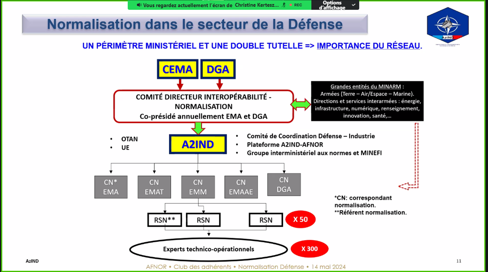

**nouvelle agence AFNOR : agence-A2IND**

Gal. Michel Minter

# Pourquoi la normalisation?

Paradoxe :

* Armée hors normes, habitude extra-ordinaire
* Doctrines différentes

vs.

* objectifs de coalition.
* éviter la cacophonie militaire.
* procedure partagées pour être efficace
* interoperabilité
* equipement semblable donc achats communs
* export pour les industriels

STANAG : accord technico militaire. Norme militaire. Standardisation Agreement

- concerne l'action militaire
- aspects connexes (echanges de munition, info, ...)

On retrouve les STANAG dans les contrats d'export

# Normalisation à l'OTAN

Defense collective

opérer ensemble

- Efficace et coordonnée

STANAG

- procédure : exemple procédure ravitaillement (opération, arrivée, transition)
- technique : exemple procédure ravitaillement (connextion avion de chasse et ravitailleur)

Rien n'est imposé à l'OTAN mais

- à condition de participer
- à condition de dire qu'on n'est pas d'accord.

à l'OTAN : compétition d'industriels.

- les états défendent des **positions d'industriels nationaux**

# à l'UE : technique

L'Agence Européenne de Défense : ne développe pas de standard

-> OTAN et Civil

l'AED sélectionne les meilleures entre les 2.

et fais état des manques et besoins normatifs : Joint Maintenance Group

-> via un rapport de groupe.

Inventer des solutions militaires à partir de matériels normés par des civils

exemples : essaims de drones dans un espace civil en Ukraine

Agence Armee vers industrie : agence-A2IND

sur site : armement.defense.gouv.fr

Unité de coordination : réseautage et influence.

