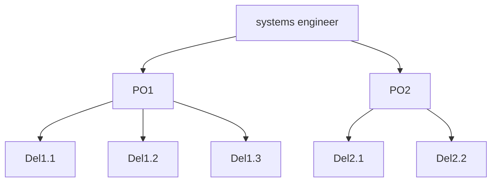

#INCOSE
#SSWWG
#Agile

Introduce a change : New digital Product/system

Groups : considers systems thinking lack will make the Agile era failing.

Social Network analysis for a post Agile (scrum, PO, ...) era.
- all about influences. Who is influencing who.

(social network map) ![[Pasted image 20221013184554.png]]

Lecture Wood : 
- Applicable for decision paths, knowledge management construction and evaluation, systems engineering culture, information and culture pervasion, pattern identification (silos, federations, ...)
- Framework : 
	- based on adhoc analysis of program
	- integrate systems engineer teams, SW development teams
- Information propagration could be improved inputting 
	- ticketting systems
	- more information about organisation : Change Control Boards, SteerCo, ...
- Section 6.7 : lack of comprehension of the organisation by stakeholders is perceived as a weaknew but it is a strength. Framework can correct mis-understanding of the oganisation.

