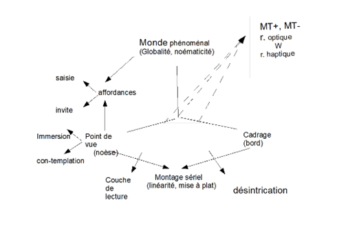

Pierre Bourdon

Les lieux d'affordance - 

Délimitation des place enclose
prise : proximité, contacte
Appropriation d'un objet. 
couple : distance et appropriation

Alois Riedel : relation optique x relation haptique (toucher)
-> possibilité du regard.
établir des rapports distanciels
Deleuze : logique de la sensation (tome 1 - ch 14)

Autre concept : Pascal Parré:  spatialiser haptiquement.
-> passer d'optique à haptique : mouvement de focalisation
    or c'est un changement, une discontinuité
    on devrait parler de régime optique et régime haptique

Ajout de lu toucher à la vue : ajout sensibilité à la vue.
-> bacon : la logique de la sensation. Pour Bacon, le tableau est une oeuvre haptique plutôt qu'optique
-> haptique généralise la sensation
-> deleuse : propose relation entre les sens, une relation du toucher de l'oeil.
-> le peintre prend sur le fait comme on prend sur le vif.
-> Deleuze : une prise de l'oeil.

comprendre la ligne dans le monde haptique et dans le monde optique.
-> exemple trajet d'un bateau sur une carte : 
    construction d'un graphe et non d'une forme.
    ou
    indépendance des points : parcours nomade.

le monde habité est un maillage réticulaire.

La sensibilité haptique ne perçoit pas la profondeur.
note : comme un tableau
c'est le travail de l'oeil d'organiser la profondeur en perspective.

Proximité pour faire le lien entre haptic et optique :
Deleuze : le peintre ne peut s'éloigner de son tableau. Ex. Rotko : pas à plus de 50 cm.

-> r = regime
2 pôles opposé : 
- Monde phénoménal : projection de catégorie. Ce n'est pas un monde réel. C'est un monde écranique (projeté).
- point de vue : permet de distinguer l'horizon.

L'affordance permet la prégnance.
