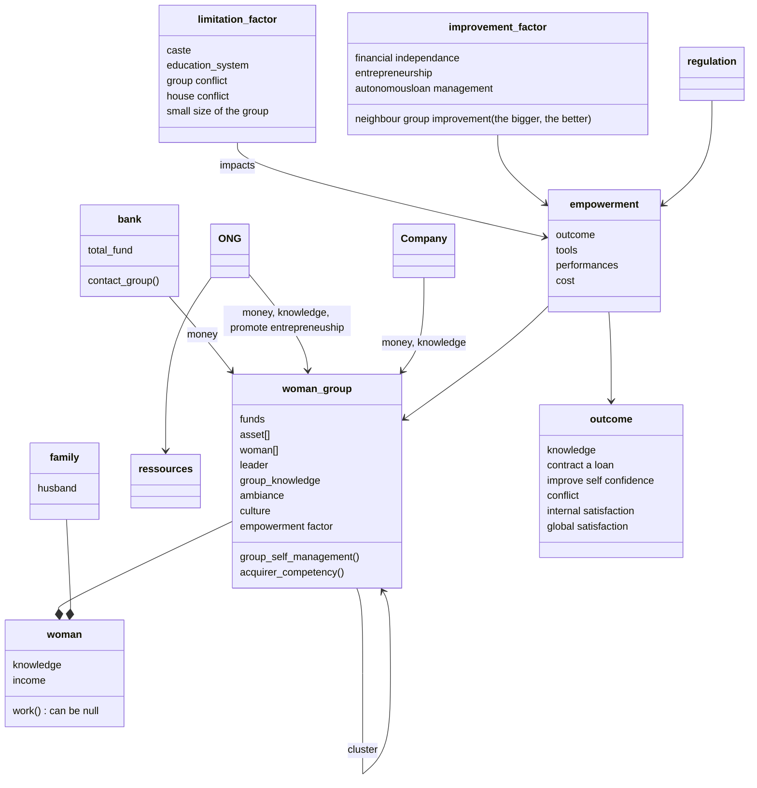

#Bauhaus
#WomanEmpowerment 

Outil Complex Adaptive System (CAS)
-> AWESOME

Anatomy de l'Empowerment : 3 domaines dominants 
- Internes : "Power withing", self 
- Relational/Interactional : "Power With", Ressources dispo, contexte intitutionnel
- Comportemental : "power to", Achievement of choices, Acces aux ressources

---
Context

---
#actions
- model of forces, limiter
- recenser les méthodes systems thinkings appliquées